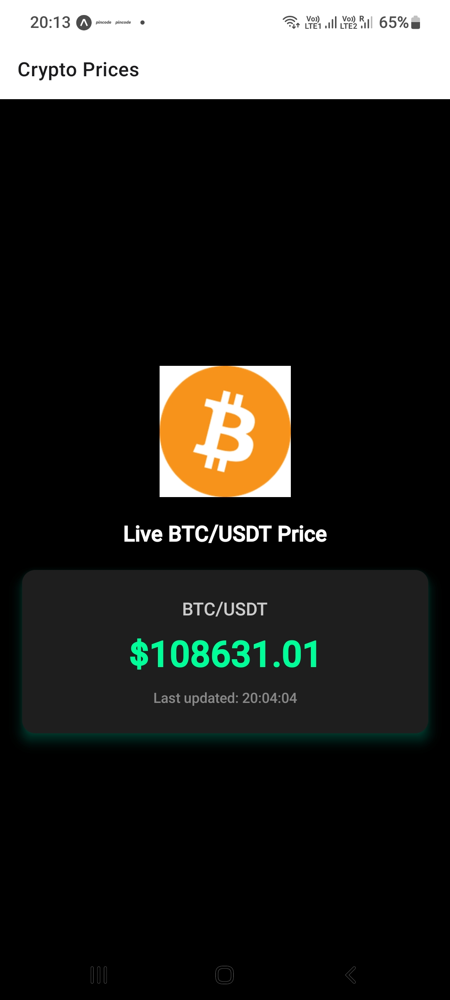

# 📈 Live Crypto Price Tracker

A simple and responsive React Native app built with **Expo** that displays real-time cryptocurrency prices (e.g., BTC/USDT) using the **Binance WebSocket API**. Ideal for learning WebSockets and React Native UI.

---

## 🚀 Features

- ✅ Real-time price updates via Binance WebSocket
- ✅ Color-coded price changes (green ↑ / red ↓)
- ✅ Timestamp for last update
- ✅ Mobile-first UI with dark theme
- ✅ Splash screen and app icon

---

## 📱 Screenshots



---

## ⚙️ Setup Instructions

1. **Clone the repository**

   ```sh
   git clone https://github.com/nikk0895/Aroras-App.git
   cd Aroras-App
   ```

2. **Install dependencies**

   ```sh
   npm install
   ```

3. **Run the app**
   ```sh
   npx expo start
   ```
   Then scan the QR code in the Expo Go app on your phone.

---

## 📦 Project Structure

```
.
├── App.tsx                   # App entry point with navigation
├── assets/                   # App logo, splash, screenshots
├── components/PriceCard.tsx  # Card UI for live prices
├── hooks/useBinanceSocket.ts # WebSocket hook for price stream
├── screens/HomeScreen.tsx    # Main UI screen
└── README.md
```

---

## 🌐 Binance WebSocket Source

This app connects to the official Binance Spot WebSocket stream:  
`wss://stream.binance.com:9443/ws/btcusdt@trade`  
More info here: [Binance Spot WebSocket Docs](https://binance-docs.github.io/apidocs/spot/en/#websocket-market-streams)
